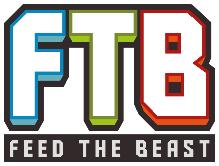
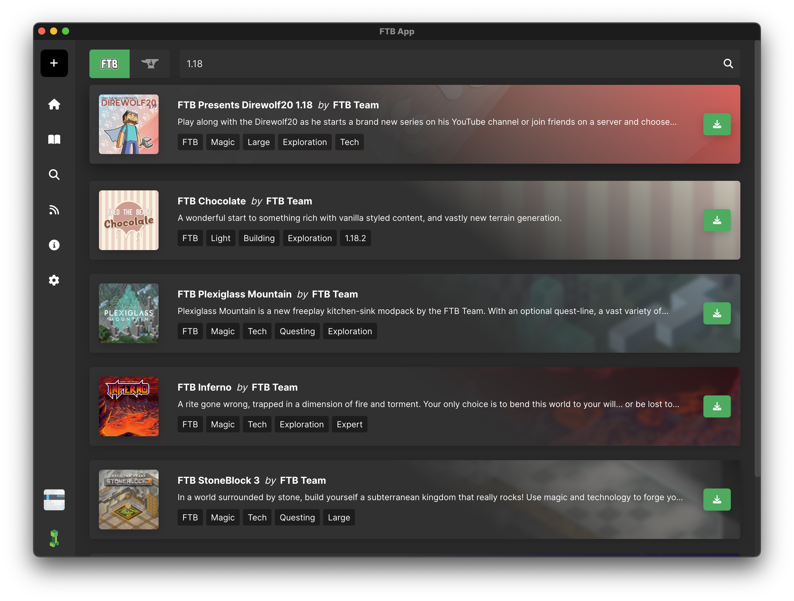

<h1 align="center">FTB App</h1>

Welcome to the FTB App! Our app is designed to provide our users with a simple and easy way to install, update, and customise their FTB Modpacks. We have built-in support for CurseForge modpacks and mods as well as instance management, pack customisation, and a whole lot more.

## Features

- **Simple and Easy to Use**: Our app is designed to be simple and easy to use for all users, regardless of their experience with modpacks.
- **CurseForge Modpacks and Mods**: We have built-in support for CurseForge modpacks and mods, making it easy to install and update your favourite modpacks and mods.
- **Instance Management**: Change your modpacks name, artwork, Java version, settings, and more.
- **Pack Customisation**: Customise your modpacks with ease, add more mods from CurseForge, or upload your own mods. You can also customise your modpacks settings, such as the amount of RAM, Java Version, JVM Arguments, Startup arguments and more.
- **Browse and Install Modpacks**: Browse and install modpacks from FTB & CurseForge.
- **Sharing**: Share your modpacks with friends with just a few clicks.

## Download

You can download the latest version of the FTB App from our [website](https://feed-the-beast.com/app).

## Contributing

We welcome any and all contributions to the FTB App, we see our app as a community project and we would love to have you involved.

## Support / Issues

If you have any issues with the FTB App, please open an issue on our [GitHub](https://github.com/ftbteam/ftb-app)

## Development

The FTB App is built using Electron and Vue(2) and is written in TypeScript, styled with Scss and TailwindCSS. We also have a Java backend that uses websockets to communicate with the frontend.

### Prerequisites

- Node.js
- PNPM (We require PNPM to be used for package management)

### Getting Started

1. Clone the repository
2. Run `pnpm install` to install the dependencies
3. Run `pnpm run dev` to start the development server
4. Run `pnpm run build` to build the app (Please note this is not required for development)

### Java

1. Load the `/subprocess` folder into your IDE
2. Let the IDE handle the rest
3. When using IntelliJ (Highly recommended), a `Start Backend` run configuration will be created for you
4. Run the `Start Backend` run configuration to start the Java backend

> Running the backend is require for frontend development, as the frontend communicates with the backend via websockets.

### Notes on Overwolf

The FTB App, as of `1.25.0` has officially moved onto Electron. The app is still cross built to the overwolf platform. We do not expect any contributions to be made for the overwolf (`/overwolf` folder) as we are actively phasing it out and to develop for the overwolf platform, you would need an approved Overwolf developer account.

> Please note, this only applies to the FTB App for Windows, the FTB App for Mac and Linux has always been built on Electron.

#### Why the move?

As we've already mentioned, we see the FTB App as a community project and with this, we listen to our community. We've had a lot of feedback about our use of the Overwolf Platform and have decided that now Overwolf is supporting, what they call, "Electron Apps", we now have the ability to move to Electron but still have the 'benefit' of being an ad supported app.

## Looking for a Modded Minecraft Server? `Ad`

